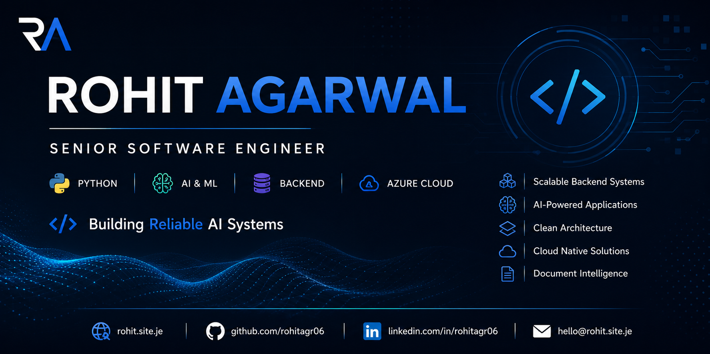

<!-- Banner -->

  

<h1 align="center">Hi 👋, I'm Rohit Agarwal</h1>

<h3 align="center">
Senior Software Engineer • Python Developer • AI & Backend Engineer
</h3>

Building scalable backend systems, AI-powered applications, and production-ready software architecture.

---

# 🌐 Portfolio

**Website:** https://rohit.site.je

**Resume:** https://rohit.site.je/resume

**Blog:** https://rohit.site.je/blog

---

# 👨‍💻 About Me

- 💼 Senior Software Engineer
- 🐍 Python Backend Developer
- 🤖 AI Application Engineer
- ☁️ Azure Cloud Developer
- 🏗️ Software Architecture Enthusiast
- 📄 Document Intelligence & OCR
- 🧠 Retrieval-Augmented Generation (RAG)
- 🚀 Building production-ready AI systems

Currently building **MediScan**, an AI-assisted medical report analyzer focused on deterministic medical reasoning and explainable AI.

---

# 🚀 Featured Projects

## 🩺 MediScan (Flagship Project)

AI-assisted Medical Report Analyzer built with deterministic medical reasoning.

### Highlights

- OCR Pipeline
- Intelligent Report Parser
- Medical Knowledge Base
- Explainable AI
- Severity & Urgency Engine
- RAG
- Multi-LLM Support
- Production Architecture

🔗 Project Page

https://rohit.site.je/projects/mediscan

🔗 GitHub

https://github.com/rohitagr06/mediscan

---

## 🌍 Personal Portfolio

Modern portfolio showcasing my projects, technical blogs, and engineering journey.

https://rohit.site.je

---

# 🛠 Tech Stack

### Languages

Python • SQL • JavaScript • HTML • CSS

### Backend

FastAPI • Flask • REST APIs

### AI

OpenAI • Gemini • GitHub Models • RAG

### OCR

PaddleOCR • PyMuPDF

### Database

SQLite • PostgreSQL

### Cloud

Azure

### DevOps

Docker • GitHub Actions • CI/CD

---

# 📚 Latest Blog Posts

- Building MediScan: Engineering a Safety-First AI Medical Report Analyzer
- Why Deterministic AI Matters in Healthcare
- Designing Explainable AI Systems
- Lessons Learned Building Production AI Applications

👉 https://rohit.site.je/blog

---

# 📈 GitHub Stats

---

# 📫 Connect With Me

🌐 Website

https://rohit.site.je

💼 LinkedIn

https://www.linkedin.com/in/rohitagr06/

📧 Email

rohitagr06@gmail.com

🐙 GitHub

https://github.com/rohitagr06

---

# ⭐ Quote

> "Great AI isn't created by better prompts alone. It's built through strong software engineering, deterministic design, and systems users can trust."
